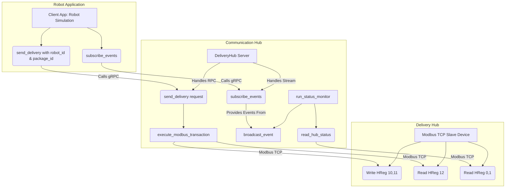

```mermaid
graph TD
    %% Subgraph for the gRPC Robot Simulation
    subgraph Robot Application
        CLIENT_APP[Client App: Robot Simulation]
        CLIENT_REQ(send_delivery with robot_id & package_id)
        CLIENT_SUB(subscribe_events)

        CLIENT_APP --> CLIENT_REQ
        CLIENT_APP --> CLIENT_SUB
    end

    %% Subgraph for the Communication Hub (Your Rust Application)
    subgraph Communication Hub
        HUB_APP[DeliveryHub Server]
        HUB_SEND_DELIVERY(send_delivery request)
        HUB_SUBSCRIBE_EVENTS(subscribe_events)
        HUB_EXEC_MODBUS[execute_modbus_transaction]
        HUB_BROADCAST[broadcast_event]
        HUB_STATUS_MONITOR[run_status_monitor]
        HUB_READ_STATUS(read_hub_status)

        HUB_APP -- Handles RPC --> HUB_SEND_DELIVERY
        HUB_APP -- Handles Stream --> HUB_SUBSCRIBE_EVENTS

        HUB_SEND_DELIVERY --> HUB_EXEC_MODBUS
        HUB_STATUS_MONITOR --> HUB_READ_STATUS
        HUB_STATUS_MONITOR --> HUB_BROADCAST
        HUB_SUBSCRIBE_EVENTS -- Provides Events From --> HUB_BROADCAST
    end

    %% Subgraph for the Modbus TCP Slave (Delivery Hub Hardware)
    subgraph Delivery Hub
        MODBUS_APP[Modbus TCP Slave Device]
        MODBUS_WRITE_REQ(Write HReg 10,11)
        MODBUS_READ_RES(Read HReg 12)
        MODBUS_READ_STATUS(Read HReg 0,1)

        MODBUS_APP --> MODBUS_WRITE_REQ
        MODBUS_APP --> MODBUS_READ_RES
        MODBUS_APP --> MODBUS_READ_STATUS
    end

    %% ======================= Connections Between Applications =======================

    CLIENT_REQ -- Calls gRPC --> HUB_SEND_DELIVERY
    CLIENT_SUB -- Calls gRPC --> HUB_SUBSCRIBE_EVENTS

    HUB_EXEC_MODBUS -- Modbus TCP --> MODBUS_WRITE_REQ
    HUB_EXEC_MODBUS -- Modbus TCP --> MODBUS_READ_RES

    HUB_READ_STATUS -- Modbus TCP --> MODBUS_READ_STATUS
```